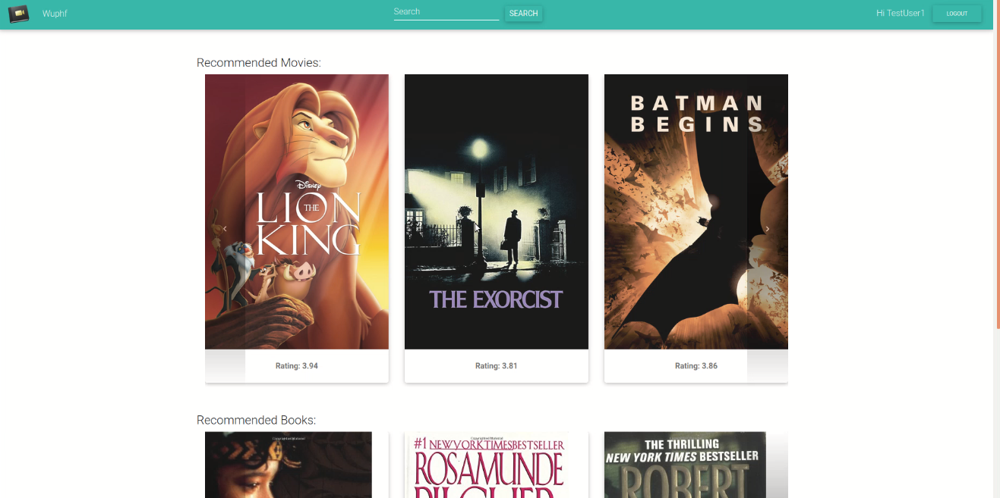

# Movie-Book-Recommendation-System

 

The aim is to create a joint movie and book cataloging system. Users will be able to search for books and movies. They can give ratings to every item. Based on users’ ratings for both the domains(books, movies), our system will recommend new books and movies. This will particularly help motivate users to start reading books, by starting with those that match their movie preferences.  

Currently, there exist similar online applications separately for books(Goodreads) and movies(IMDB), but, to the best of our knowledge, nothing that combines both to generate high-quality recommendations and provide a rich, unified user experience.

## Features
- Users must register on the website to get recommendations.
- Recommendations are generated based on the user's preferences in both movies and books.
- Users can search for books and movies by keyword in title and by genre.
- Each movie has a separate page with summary, genres, cast, box office, running time, release date and average rating.  
- Similarly ,each book has a separate page with author, summary, genres, publisher, number of pages, release year and average rating.  

# Technology Stack
- Server - Spring Boot, microservice based architecture
- Database - MongoDB
- Client - ReactJS

# Server Architecture
The server was designed with a microservice-based architecture, where each independent component runs as a separate service. This makes the system horizontally scalable.
Details about the services are given in [Design Document.pdf](./Design%20Document.pdf)

# Recommender System
- Implemented the research paper [Transfer Learning for Collaborative Filtering via a Rating-Matrix Generative Model](https://dl.acm.org/citation.cfm?id=1553454)
- Datasets: MovieLens, Book Crossing
- Recommendations based purely on ratings
- Multiple domains solve sparsity problem in user-rating matrix
- Algorithm based on the fact that movies and books are very similar domains
- Overall set of items(movies + books) and set of users clustered into 30 item-clusters and 30 user-clusters respectively, using the rating values.
- Expectation-Maximization algorithm learns probability distributions for user-cluster membership, item-cluster membership, and user-item cluster pair average rating.
- These membership probabilities are used to determine cluster of test user, find the item cluster it prefers(rates) the most, and find the items from that item-cluster

# Installation Instructions
## Backend
- Install java 8: `sudo apt-get install openjdk-8-jdk`
- Install maven: `sudo apt install maven`
- Set `JAVA_HOME` by adding the following command in `.bashrc` file  : `export JAVA_HOME="/usr/lib/jvm/java-1.8.0-openjdk-amd64"`
- Restart the terminal after installation

## Frontend
Run `npm install` inside the directory `frontend/my-app`

# Running instructions
## Backend
- Go into backend directory: `cd backend/`
- Go into config service directory: `cd config-service/`
- start config service: `mvn spring-boot:run`
- Go into eureka service directory: `cd eureka-service`
- Start eureka service: `mvn spring-boot:run`
- Start all other services similarly
**NOTE** - Start the config service first, then eureka service and then all other services

## Frontend
Run `npm start` inside the directory `frontend/my-app`

# Screenshots

